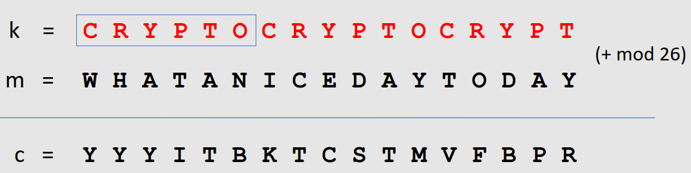
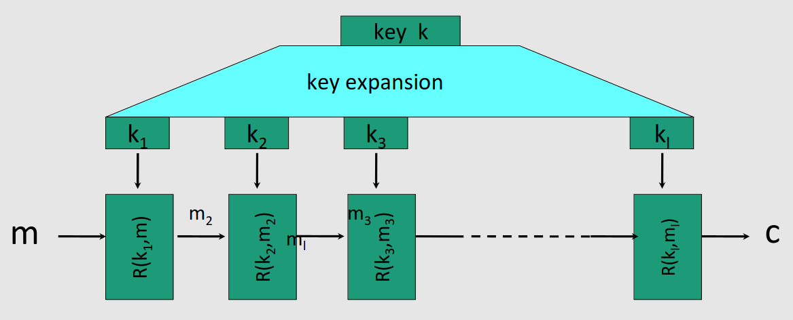
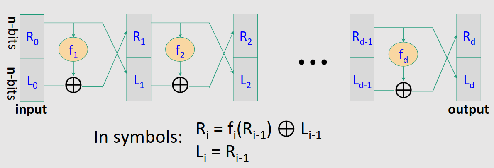
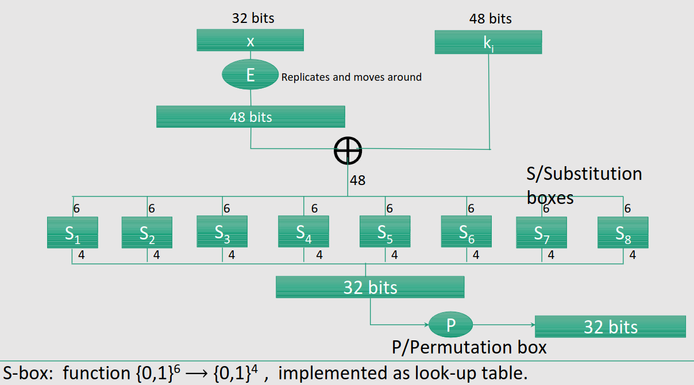
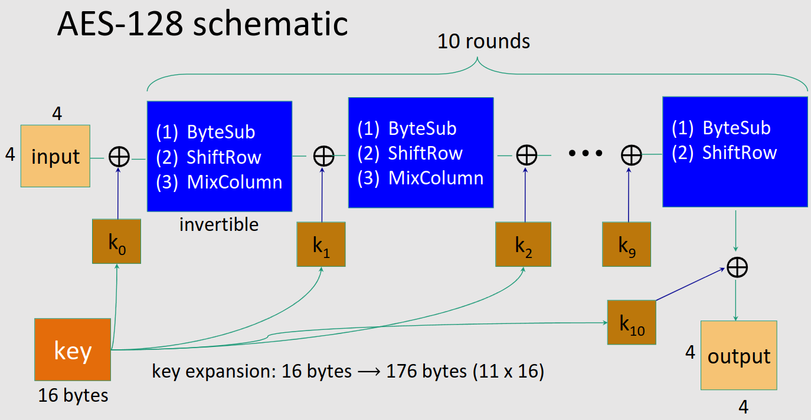

# Overview
## Programma
- Introduction to Cybersecurity
- Cryptography
- Passwords and authentication
- Systems security
- Internet security
- Wireless security
- Privacy: anonymous communication, data privacy
- Web security?

## Introduction
### What is Cybersecurity?
- Tecnology/Mesure/Practice
- To prevent or mitigate the impact
- Cyberattacks

Cyberattacks: Intentional effort to steal, expose, alter, disable or destroy data/applications

### CyberAttacks
- Pishing and Social-Engineering-Based attacks
- Internet-facing service risks
- Password-related account compromises
- Misuse of information
- Network-related and man-in-the-middle attacks
- Supply chain attacks
- (Distibuted) Denial of Service attack
- Ransomware

### Definitions
- Vulnerability: A weakness that can be exploited to cause damage
- Attack: A method of exploiting a vulnerability
- Threat: A motivated, capable adversary that mounts an attack
- Zero-day vulnerability: A vulnerability that is unknown to those who should be interested in mitigating it
- Window of Opportunity: Time from when a software exploit first becomes active to the time when a patch is released by the affected vendor and applied to the affected system
- Zero-day attack: an attack that occurs during the window of opportunity

## Introduction to Cybersecurity

### Definitios
- Cryptography: Science of using math to **obscure** the meaning of the message
- Cryptoanalysis: Science of breaking encryption
- Cryptology: Cryptography + Cryptoanalysis

- Steganography: “covered writing”, hides the **existence** of a message
- Cryptography: “hidden writing”, hide the **meaning** of a message

Objective: Ensure secure communication over insecure medium

Goals:
    - Privacy (secrecy, confidentiality)
    - Authenticity
    - Integrity
    - Non-repudiation

Protocols that Enable parties to **communicate securely** and Achieve goals to **protect message confidentiality and integrity**

> Kerckhoff‘s principle: The security of a protocol should rely only on the secrecy of the keys, while protocol designs should be made public (1883)

### Attacker threat model
Two types of attacks:
- Passive: Only observes and decrypt messages
- Active: Observes, modifies, injects, or deletes messages

- Interaction with the encryption algorithm
    - Ciphertext-only attack: attacker only sees encrypted messages
    - Chosen-plaintext attack (**CPA**): Attacker may choose a number of messages and obtain the ciphertexts for them
    - Chosen-ciphertext attack (**CCA**): Attacker may choose a number of ciphertexts and obtain the plaintexts
    - Both CPA and CCA attacks may be adaptive: Choices may change based on results of previous requests

### Symmetric Encryption
- Same key for encryption and decryption
- Can use:
    - Single use keys: One key for every message
    - Multiple use keys: One key for multiple messages

### Asymmetric Encryption
Use public key for encryption and private key for decryption

### What can Cryptofraphy do
- Message Encryption
- Digital Signature
- Anonymous communication
- Anonymous digital cash

### History of Crypto
#### Symmetric Ciphers
Esempio: Cifrario di Cesare

The key space is really small, 26 possible keys, may be broken with brute force attack

#### *Mono*alphabetic substitution Ciphers
Table with how to substitute each letter of the alphabet

The space key is $26! \approx 2^88$, but may be broken with frequency analysis, with single letters or pairs (or more) of letters

#### Vigenère Cipher (16th century)
It's basically a *Poly*alphabetic substitution cipher

- Collection of Shift Ciphers
- One letter in the ciphertext corresponds to multiple letters in the plaintext
- Frequency analysis more difficult

We can break it with:
- Guess the length of the key $l$ using some methods
- Divide the ciphertext into $l$ shift cipher encryptions
- Use frequency analysis on each shift cipher

#### Rotor Machines
We can have a longer key by having multiple rounds of substitutions

- Hebern machine with single rotor
- Enigma with 3-5 rotor

## Stream Ciphers
### One Time Pad
First example of "secure" cipher

The key is used only once, it's random and it has a uniform distribution over the key space

The problem is that the key must be as long as the plaintext (we'll see thing in binary)

For encryption we use the XOR binary operator with `m` and `k`, so we get `c`

### PseudoRandom Generators (PRGs)
We can make OTP practical by generating a PRG, that map a shorter key to a longer key, with the length equal to the message length, this is called **Stream Cipher**

This doesn't have perfect secrecy, because the key is shorter than the message (what count is the original key, not the one pseudorandom generated)

So the security depend how good is a specific PRG

### Possible Attacks
> TL;DR: Never use a key more than once, there is enough redundancy in English and ASCII encoding that from `m1 XOR m2 -> m1, m2`

For network traffic negotiate a new key for every session (as in TLS), one for client -> server, one for server -> client

#### Real world examples
##### 802.11b WEP
We send the **Initialization Vector** (IV) and the ciphertext, obtained by doing:

$$(m + CheckSum(m) \oplus PRG(IV + k), \quad \text{with + as concatenation operator}$$

The IV has length of 24 bits, the key has length of 104, this means that the keys for each frame are very related, so this is not secure!

##### Disk Encryption
Re encrypt only modified blocks

#### No Integrity (OTP is malleable)
The attacker can read and modify the ciphertext, in particular:
- Can alter the message by adding random stuff
- Can add `XOR p` to the original message
- Can invert a True or False response (if this is sent by a single bit)
- Can change part of the message (Alice -> Maria)

### Rivest Cipher 4 (RC4)
- It start by initializalizing the array `S`, that will be used for extracting pseudo random numbers
- This is done by shuffling "randomly" (we use a seed) an array from 0 to 255
- After that we can extract any time we want a pseudo random generated number, but we also swap two elements of the array `S`

The problems with this ciphter are:
- The seed must be equal for Alice and Bob
- The setup algorithm is not perfect
- Even if the setup algorithm was perfect, the output of RC4 is biased

### Modern stream ciphers (eStream)
They use a nonce along the key (seed) in the PRG, and the pair (key, nonce) is never used more than once

Example: Salsa 20 (SW + HW), 10 round of function $h$, which is invertible and designed to be fast on x86

### When a PRG is "secure"?
> It needs to be **unpredictable**

$$\forall i, \text{ there is no "efficient" way to predict bit } (i+1) \text{ for not negligible } \epsilon \\ \Rightarrow G: K \rightarrow {0, 1}^n \text{is predictable}$$

#### Advantage
**Statistical Test**: Algorithm $A: {0, 1}^n \rightarrow {0, 1}$

Advantage is defined as the difference of the probability between $A(G(k))$ and $A(r)$, with a good statistica advantage you can distinguish G from Random

#### Secure PRGs: crypto definition
We say that $G: K \rightarrow {0,1}^n$ is a secure PRG if for every “efficient” statistical test $AR, $Adv_{PRG}[A,G]$ is “negligible”

#### Thm: an unpredictable PRG is secure
This is done by showing that PRG predictable implies that the PRG is insecure

### Semantic security
> What is a secure cipher?
CipherText should reveal no "info" about PlainText, Shannon's idea

#### Shannon's perfect secrecy
Let $(E, D)$ be a cipher over $(K, M, C)$

$$(E, D) \text{ has perfect secrecy if } \forall m_0, m_1 \in M (|m_0| = |m_1|) \\ { E(k,m_0) } = { E(k,m_1) } \text{ where } k \leftarrow K$$

- The two distributions must be identical
- Too strong definition
    - It requires long keys
    - Stream Ciphers can't satisfy it

#### Weaker Definition
> Rather than requiring the two distributions to be identical, we require them to be COMPUTATIONALLY INDISTINGUISHABLE

- Also need adversary to exhibit $m_0, m_1 \in M$ explicitly

#### One Time Key
> $Q$ is *semantically secure* if for all "efficient" $A$, $Adv_{SS}[A, Q]$ is **negligible**

## Block Ciphers
They are built by iteration

$R(k, m)$ is a **round function**

### Feistel Network

Given $f_1, \dots, f_d: {0, 1}^n \rightarrow {0, 1}^n$ (not necessarily invertible), build an **invertible** function $F: {0, 1}^{2n} \rightarrow {0, 1}^{2n}$

For every $f_i$ $F$ is invertible, you need to construct the inverse:
$$R_{i-1} = L_i \\
L_{i-1} = f_i(L_i) \oplus R_i$$

This is used in many block ciphers, but not AES

### DES (Data Encryption Standard)
> A 16 round Fiestel network, with 64 bit as input, and a key of 56 bits (than you expand it to 16 keys of 48 bits each)

Function $f_i(x) = F(k_i, x):

S-boxes and P-box are chosen such that you can get a secure block cipher (choose that at random makes it not secure)

### Exhaustive Search for block cipher key
> Goal: given a few input output pairs $(m_i, c_i = E(k, mi)) \quad i = 1, \dots, 3$ find key k.

**2 input/output pairs are enough for an exhaustive key search**

### Exhaustive Search Attacks
> DES can be broken really fast today -> 56-bit ciphers should not be used

#### Strengthening DES against exhaustive search
- Triple-DES
    - Combine Encryption, Decryption and Encryption with 3 different keys
    - Key length = 168 bits
    - "Real" Key space = $2^118$
    - Triple-DES prevents the Meet in the middle attack (get a partial encrypted message)
        - You can do a MITM attack with Triple-DES but the key space become $2^118$
    - This does not increase the security by that much, also this is slower
- DESX
    - Integrate XOR operations with 3 keys, but still insecure

Quantum computers are much faster in breaking DES and it's variants

### Advanced Encryption Standard
- It's not a Feistel cipher
- Can be partially computed in parallel
- Block cipher that works iteratively
- Each round (except the last) is a uniform and parallelal composition of 4 steps:
    - SubBytes (byte-by-byte substitution using an S-box)
    - ShiftRows (a permutation, which cyclically shifts the last three rows in the State)
    - MixColumns (substitution that uses Galois Fields, corps de Galois, GF($2^8$) arithmetic)
    - Add Round key (bit-by-bit XOR with an expanded key)

Note: 16 bytes = 128 bits
